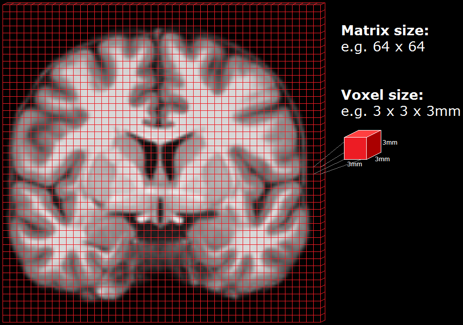
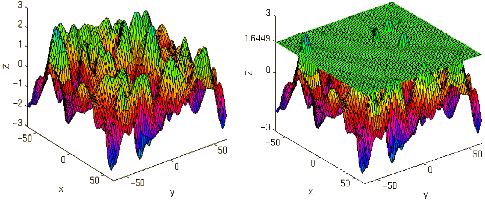
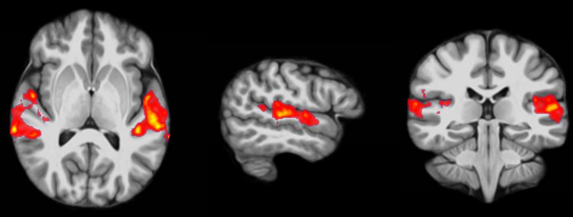

============================
Introduction to Neuroimaging
============================

With this part I want to introduce you to the basics of analyzing neuroimaging data. I want to give you a brief explanation of how the neuroimaging data is acquired, how the data is prepared for analysis (also called preprocessing) and, eventually, how you can test your data on a model based on your hypothesis.

.. note::

    This part serves as a brief introduction to neuroimaging. Further information on this topic can be found under the `Glossary <http://miykael.github.com/nipype-beginner-s-guide/glossary.html>`_ and `FAQ <http://miykael.github.com/nipype-beginner-s-guide/faq.html>`_ pages of this beginner's guide.

Acquisition of MRI Data
=======================

.. only:: html

    .. image:: images/brain.gif
       :width: 160pt
       :align: left

The technology and physics behind an MRI scanner is quite astonishing. But I won't go into details on how that all works. Nonetheless, you need to know some terms, concepts, and parameters which are used for the steps taken to acquire and MRI image.

.. only:: latex

    .. image:: images/brain.png
       :width: 160pt
       :align: center

The volume data of a whole brain recorded at one single timepoint, as pictured on the left, is called a **volume** and consists of multiple voxels (pixels in 3D). Each **voxel** has a specific dimension, in this case it's an isotropic dimension of 1mm x 1mm x 1mm. Each voxel contains one value which stands for the average signal measured at the given location. A standard anatomical volume, with an isotropic voxel resolution of 1mm contains almost 17 million voxels, which are arranged in a **3D matrix** of 256 x 256 x 256 voxels. The following picture describes a vertical slice through such a brain volume and depicts in general the grid like structure of this 3D Matrix, consisting of multiple voxels.

As the scanner can't measure the whole volume at once it has to measure it sequentially. This is done by measuring one plane of the brain  (generally the horizontal one) after the other. Such a plane is also called a **slice**. The resolution of the measured volume data therefore depends on the in-plane resolution, the number of slices, their thickness, and a possible gap between them.

The quality of the measured data depends on the resolution and the following parameters:

* **repetition time (TR)**: time required to scan one volume
* **acquisition time (TA)**: time required to scan one volume. TA = TR - (TR/number of slices)
* **field of view (FOV)**: defines the extent of a slice, e.g. 256mm x 256mm

Modalities of MRI Data
======================

There are many different kinds of acquisition techniques. But the most common ones are structural magnetic resonance imaging (**sMRI**), functional magnetic resonance imaging (**fMRI**) and diffusion tensor imaging (**DTI**).

sMRI (structural MRI)
*********************

.. only:: html

    .. image:: images/GM.gif
       :width: 270pt
       :align: left

Structural magnetic resonance imaging (**sMRI**) is a technique for measuring the anatomy of the brain. By measuring the amount of water at a given location, sMRI is capable of acquiring a detailed anatomical picture of our brain. This allows as to accurately distinguish between different types of tissue, such as gray and white matter. Structural images are used for multiple purposes, such as corregistration, normalization, segmentation, and surface reconstruction.

.. only:: latex

    .. image:: images/GM.png
       :width: 270pt
       :align: center

As there is no time pressure during acquisition of anatomical images (the anatomy is not supposed to change while the person is in the scanner), a higher resolution can be used for recording anatomical images, with a voxel extent of 0.2 to 1.5mm, depending on the strength of the magnetic field in the scanner, e.g. 1.5T, 3T or 7T. Grey matter structures are seen in dark, and the white matter structures in bright colors.

fMRI (functional MRI)
*********************

.. only:: html

    .. image:: images/BOLDresponse.png
       :width: 270pt
       :align: right

Functional magnetic resonance imaging (**fMRI**) is a technique for measuring brain activity. It works by detecting the changes in blood oxygenation and blood flow that occur in response to neural activity. Our brain is capable of so many astonishing things. But as nothing comes from nothing, it needs a lot of energy to sustain its functionality and has to increase the energy locally if additional functions are needed. This neuronal activity requires energy in the form of O2 which is carried by the blood. Therefore, increased function results in increased blood flow towards the energy consuming location.

.. only:: latex

    .. image:: images/BOLDresponse.png
       :width: 270pt
       :align: center

Immediately after neural activity the blood oxygen level decreases, known as the *initial dip*, because of the local energy consumption. This is followed by the increased flow of new and oxygen rich blood towards the energy consuming region. After 4-6 seconds a peak of blood oxygen level is reached. After no further neuronal activation takes place the signal decreases again and goes through an undershoot, before it reaches the baseline again.

This blood oxygen level is exactly what we measure with fMRI. The MRI-Scanner is able to measure the change in the magnetic field caused by the difference in the  magnetic susceptibility of oxygenated (diamagnetic) and deoxygenated (paramagnetic) blood. The signal is therefore called the **Blood Oxygen Level Dependent (BOLD) respond**.

.. only:: html

    .. image:: images/WM.gif
       :width: 270pt
       :align: left

.. only:: latex

    .. image:: images/WM.png
       :width: 270pt
       :align: center

Because the BOLD signal has to be measured very fast, the resolution of functional images is normally lower (2-4mm) than the resolution in a structural images (0.5-1.5mm). But this depends strongly on the strength of the magnetic field in the scanner, e.g. 1.5T, 3T or 7T. In a functional image, the gray matter is seen as bright and the white matter as dark colors, which is the exact opposite to structural images.

Depending on the paradigmn, we talk from an **event-related**, **block** or **resting-state design**:

* **event-related design**: Event-releated means that the stimuli shown to the participants in the scanner, are only shown briefly and generally in random order. This means that the BOLD response consists of short bursts (peak) and look more or less like the line shown in the picture above.
* **block design**: If multiple stimulation of similar nature are shown in a block or phase of 10-30 seconds, we talk about a block design. Such a design has the advantages that the peak in the BOLD signal is not just reach for a short period but stays on a plateau for a longer time. This makes it easier to detect an underlying activation increase in the brain.
* **resting-state design**: Resting-state paradigms are acquisition in the absence of stimulation. Subjects are asked to lay still and rest in the scanner, without falling asleep. The goal of such a scan is to record brain activation in the absence of an external task. This is sometimes done to analyze the functional connectivity of the brain.

dMRI (diffusion MRI)
********************

.. only:: html

    .. image:: images/tractography_small.gif
       :align: left

Diffusion imaging is done to get information about the brain's white matter connections. There are multiple modalities to record diffusion images, such as diffusion tensor imaging (DTI), diffusion spectrum imaging (DSI), diffusion weighted imaging (DWI) and diffusion functional MRI (DfMRI). By recording the diffusion trajectory of the molecules (usually water) in a given voxel, one can make assumptions about the underlying structure in the voxel. For example, if one voxel contains mostly horizontal fiber tracts, the water molecule in this region will mostly diffuse (move) in a horizontal manner, as they can't move vertically because of this neural barrier. The diffusion itself is caused mostly by the `Brownian motion <en.wikipedia.org/wiki/Brownian_motion>`_.

.. only:: latex

    .. image:: images/tractography.png
       :width: 200pt
       :align: center

There are many different diffusion measurements, such as **mean diffusivity** (MD), `fractional anisotropy <http://en.wikipedia.org/wiki/Fractional_anisotropy>`_ (FA) and `Tractography <en.wikipedia.org/wiki/Tractography>`_. Each measurement gives different insights into the brain's neural fiber tracts. An example of a reconstructed tractography can be seen in the image to the left.

Diffusion MRI is a rather new field in MRI and still has some problems with its sensitivity to correctly detect fiber tracts and their underlying orientation. For example, the standard DTI method has almost no chance to reliably detect kissing (touching) or crossing fiber tracts. To account for this disadvantage, newer methods such as **High-angular-resolution diffusion imaging** (HARDI) and Q-ball vector analysis were developed. For more about diffusion MRI see the `Diffusion MRI Wiki-homepage <http://en.wikipedia.org/wiki/Diffusion_MRI>`_.

Specifics of MRI Data
=====================

Many MRI scanners output their neuroimaging data in **DICOM** format, a standardized medical image format. But depending on the scanner, the format of your raw data can also be something else, e.g. **PAR/REC** on Philips scanners. This raw data is saved in `k-space <http://en.wikipedia.org/wiki/K-space_(MRI)>`_ with which most analysis packages can't work with. Therefore the raw data has to be converted into another, more common format, called `NIfTI <http://nifti.nimh.nih.gov/>`_. As many other MRI dataformats, **NIfTI**-files (``.nii``-file) consist also of an **image** and a **header** part.

* The **image** is the actual data and is represented by a 3D matrix that contains a value (e.g. gray value) for each voxel.
* The **header** contains information about the data like voxel dimension, voxel extend in each dimension, number of measured time points, a transformation matrix that places the 3D matrix from the **image** part in a 3D coordinate system, etc.

Analysis Steps
==============

There are many different steps involved in a neuroimaging analysis and there is not just one way to do it. Depending on the researcher, the paradigm at hand or the modality analyzed (sMRI, fMRI, dMRI), the order differs. Some steps might occur earlier or later than usual and other are left out entirely. None the less, the general fMRI analysis can be divided into the following three steps:

1. **Preprocessing**: Spatial and temporal pre processing of data with the intend of preparing it for the 1st and 2nd level analysis.
2. **Model Specification and Estimation**: Specifying and estimating parameters of statistical model
3. **Statistical Inference**: Making inferences about the estimated parameters with appropriate statistics

Step 1: Preprocessing
*********************

With the preprocessing we correct our data for head movement in the scanner, check our data for artifacts, take into account that a volume is measured slice by slice, increase the signal-to-noise ratio by smoothing it and normalize it into a common reference space. All those steps are done to match all scans of an individual subject to itself and than to match this subject into a common standard space. Therefor, the preprocessing is done to improve our data and to prepare it for the statistical analysis.

.. only:: latex

    .. raw:: latex

      \newpage

Slice Timing Correction (fMRI only)
^^^^^^^^^^^^^^^^^^^^^^^^^^^^^^^^^^^

.. only:: html

    .. image:: images/slicetiming_small.gif
       :width: 499px
       :align: right

Because most functional MRI measuring sequences don't acquire every slice in a volume at the same time we have to account for that. For example, if you acquire a volume with 37 slices in a ascending fashion and each slice would be acquired every 50ms, there still would be a difference of 1.8s between the first and the last slice. (Left: *ascending*, Right: *interleaved*)

.. only:: latex

    .. image:: images/slicetiming.png
       :width: 200pt
       :align: center

Slice Timing Correction is used to control for this time differences between the slice by temporally interpolating the slices so that it would be equivalent to acquiring the whole brain image at a single time point. This temporal factor of acquisition especially has to be accounted for in fMRI models where timing is an important factor (e.g. event related designs, where the type of stimulus can change from volume to volume).

If you use Slice Timing it is also important to know the way the slices were acquired. You can acquire the slices in a descending (top-down), ascending (bottom-up) or interleaved (acquire every second slice on one direction and every other slice on the other direction; interleaved can start in a top-down or bottom-up fashion) way.

Motion Correction (fMRI only)
^^^^^^^^^^^^^^^^^^^^^^^^^^^^^

.. only:: html

    .. image:: images/movement.gif
       :align: right
       :width: 200pt

Motion correction, also known as Realignment, is used to correct for head movement during the acquisition of functional data. Even small head movements lead to unwanted variance in voxels and minimize the quality of your data. Motion correction tries to minimize the influence of movement on your data by aligning your data to a reference time volume. This reference time volume is usually the mean image of all timepoints but can also be the first time point or which ever one you want to use.

The head movement can be divided into 6 parameters. 3 translation parameters which code the movements in the direction of the 3 dimensional axes (moving in X, Y, or Z direction) and 3 rotation parameters which code the rotation around those axes (rotation over the X, Y and Z axis).

Realignment usually uses a affine rigid body transformation to manipulate the data in those 6 parameters. Below you see a plot of a "good" subject where the movement is minimal.

.. only:: html

    .. image:: images/realignment_good.png
       :width: 400pt
       :align: center

.. only:: latex

    .. image:: images/realignment_good.png
       :width: 300pt
       :align: center

Artifact Detection (fMRI only)
^^^^^^^^^^^^^^^^^^^^^^^^^^^^^^

Not all subjects lie perfectly still and as we can see in the example below, some move quite a bit. This sudden movement can be very severe and really can contaminate your analysis. 

.. only:: html

    .. image:: images/realignment_bad.png
       :width: 400pt
       :align: center

.. only:: latex

    .. image:: images/realignment_bad.png
       :width: 300pt
       :align: center

The process of motion correction tries to correct for this movement but sometimes it's best to just take the scans with extreme rapid movement out. To do this, we use **Artifact Detection**. Artifact detection is used to declare the timepoints/scans of the functional image which vary so much in head movement that they should be excluded from further analysis. 

So if I would check the session shown above for sudden movement greater than 2 standard deviation from the mean or for movement greater than 1mm, Artifact Detection would me show that the scans 16-19, 21, 22 and 169-172 (see image below) should be excluded from further analysis.

.. image:: images/artifact_detection.png
   :align: center

Coregistration
^^^^^^^^^^^^^^

As motion correction corrects for the motion during the acquisition of functional images, coregistration corrects for motion between the structural and the functional images. In other words, coregistration moves the functional image as such that it lies perfectly on the anatomical image. This allows further transformations on the anatomical image, such as normalization, to be directly applied to the functional image without any intermediate steps.

The following picture shows an example of a good (top) and bad (bottom) coregistration between functional and anatomical images. Shown in red are the outline of the cortical folds of the anatomical image and in white and gray the functional image.

.. only:: html

    .. image:: images/coregistration.png
       :width: 400pt
       :align: center

.. only:: latex

    .. image:: images/coregistration.png
       :width: 250pt
       :align: center

Normalization
^^^^^^^^^^^^^

Normalization is done to warp the data of a subject from the individual subject-space it was measured in into a standard reference-space. This step is done to control for individual morphological variations of the brain in each subject. Only after this step a group analysis or comparison to other data can be done. There are different ways to normalize your data but it always includes a template and a source image. 

.. only:: html

    .. image:: images/normalization.png
       :width: 600pt
       :align: center

.. only:: latex

    .. image:: images/normalization.png
       :width: 500pt
       :align: left

* The **template** image is the standard brain in reference-space that you want to warp your data into. This can be a Talairach-, MNI-, SPM-template or any other reference brain you want to use.
* The **source** image (normally a structural image) is used to calculate the transformation matrix necessary to warp the source image onto the template image. This transformation matrix is than used to transform the rest of your images (functional and structural) into the reference-space.

Smoothing
^^^^^^^^^

Structural as well as functional images are smoothed by applying a filter to the image. Smoothing increases the signal to noise ratio of your data. This step helps to reduce spatial differences between subject and therefore improve comparisons across subjects. The trade-off, however, is that you lose resolution by smoothing. Additionally you have to keep in mind that smoothing can cause regions that are functionally different to  combine with each other. In such cases a surface based analysis with smoothing on the surface might be a better choice.

.. only:: html

    .. image:: images/smoothed.png
       :width: 500pt
       :align: center

    .. image:: images/kernel.png
       :width: 200pt
       :align: right

.. only:: latex

    .. image:: images/smoothed.png
       :width: 400pt
       :align: center

Smoothing is implemented by applying a 3D Gaussian kernel to the image, defined by its full width at half maximum (**FWHM**) parameter. As the name already says, FWHM specifies the width/diameter of the smoothing kernel on half of it's height. Each voxel becomes the result of applying this smoothing kernel as a weighted region of interest to its position.

.. only:: latex

    .. image:: images/kernel.png
       :width: 200pt
       :align: center

Choosing the size of the smoothing kernel also depends on the region you are interested in. If you want to study a very small region a big large kernel could eventually smooth your data too much. Thus, the amount of smoothing that you should use is determined partly by the question you want to answer.

Segmentation (sMRI only)
^^^^^^^^^^^^^^^^^^^^^^^^

.. only:: html

    .. image:: images/segmentation.gif
       :align: right
       :width: 200pt

Segmentation stands for the process in which a brain is divided into neurological sections according to a given template segmentation. This can be rather general, by segmenting the brain into gray matter, white matter and cerebrospinal fluid (like it is done with SPM's Segmentation) or quite detailed into specific regions and their subregions like it is done during FreeSurfer's ``recon-all`` process. This is is also the segmentation you see in this picture.

.. only:: latex

    .. image:: images/segmentation.png
       :align: center
       :width: 150pt

The Segmentation can be used for different things. You can use the segmentation to aid the normalization process or use it to aid further analysis by using a specific segmentation as a mask or as a definition of a specific region of interest (ROI).

Step 2: Model Specification and Estimation
******************************************

To test our hypothesis on our data we first need to specify a model that incorporates this hypothesis and accounts for multiple factors such as the expected function of the BOLD signal, the movement during measurement, experiment specify parameters and other regressors and covariates. Such a model is usually represented by a Generalized Linear Model (GLM). 

The General Linear Model
^^^^^^^^^^^^^^^^^^^^^^^^

A GLM describes a response (y), such as the BOLD response in a voxel, in terms of all its contributing factors (xβ) in a linear combination, whilst also accounting for the contribution of error (ε). The column (y) corresponds to one voxel and one row in this column corresponds to one time-point.

.. only:: html

    .. image:: images/GLM.png
       :width: 300pt
       :align: center

.. only:: latex

    .. image:: images/GLM.png
       :width: 200pt
       :align: left

* **y = dependent variable**
    observed data (e.g. BOLD response in a single voxel)
* **X = Independent Variable** (aka. Predictor)
    e.g. *experimental conditions* (embodies all available knowledge about experimentally controlled factors and potential confounds), *stimulus information* (onset and duration of stimuli), *expected shape of BOLD response*
* **β = Parameters** (aka regression coefficient/beta weights)
    Quantifies how much each predictor (*X*) independently influences the dependent variable (*Y*)
* **ε = Error**
    Variance in the data (*Y*) which is not explained by the linear combination of predictors (*Xβ*). The error is assumed to be normally distributed.

The predictor variables are stored in a so called **Design Matrix**. The **β** parameters define the contribution of each component of this design matrix to the model. They are estimated so as to minimize the error, and are used to generate the **contrasts** between conditions. The **Errors** is the difference between the observed data and the model defined by Xβ.

Potential problems of the GLM approach
^^^^^^^^^^^^^^^^^^^^^^^^^^^^^^^^^^^^^^

**BOLD responses have a delayed and dispersed form**

* We have to take the time delay and the HRF shape of the BOLD response into account when we create our design matrix.

**BOLD signals include substantial amounts of low-frequency noise**

* By high pass filtering our data and adding time regressors of 1st, 2nd,... order we can correct for low-frequency drifts in our measured data. This low frequency signals are caused by non-experimental effects, such as scanner drift etc.

.. image:: images/time.png
   :width: 350pt
   :align: center

This **High pass Filter** is established by setting up discrete cosine functions over the time period of your acquisition. In the example below you see a constant term of 1, followed by half of a cosine function increasing by half a period for each following curve. Such regressors correct for the influence of changes in the low-frequency spectrum.

.. image:: images/highpassfilter.png
   :width: 250pt
   :align: center

Example of a Design Matrix
^^^^^^^^^^^^^^^^^^^^^^^^^^

.. only:: html

    .. image:: images/stimuli.png
       :width: 200pt
       :align: right

Let us assume we have an experiment where we present subjects faces of humans and animals alike. Our goal is to measure the difference between the brain activation when a face of an animal is presented in contrast to the activation of the brain when a human face is presented. Our experiment is set up in such a way that subjects have two different blocks of stimuli presentation. In both blocks there are timepoints where faces of humans, faces of animals and no faces (resting state) are presented.

.. only:: latex

    .. image:: images/stimuli.png
       :width: 200pt
       :align: left

Now, we combine all that we know about our model into one single Design Matrix. This Matrix contains multiple columns, which contain information about the stimuli (onset, duration and curve function of the BOLD-signal i.e. the shape of the HRF). In our example column *Sn(1) humans* and *Sn(1) animals* code for the stimuli of humans and animals during the first session of our fictive experiment. Accordingly, Sn(2) codes for all the regressors in the second session. *Sn(1 resting* codes for the timepoints where subjects weren't presented any stimuli.

.. only:: html

    .. image:: images/designmatrix.png
       :width: 350pt
       :align: center

.. only:: latex

    .. image:: images/designmatrix.png
       :width: 300pt
       :align: center

The y-axis codes for the measured scan or the passed time, depending on the specification of your design. The x-axis stands for all the regressors that we specified. 

The regressors *Sn(1) R1* to *Sn(1) R6* stand for the movement parameters we got from the realignment process. The regressors *Sn(1) linear*, *Sn(1) quadratic*, *Sn(1) cubic* and *Sn(1) quartic* are just examples of correction for the low frequency in your data. If you are using a high-pass filter of e.g. 128 seconds you don't need to specifically include those regressors in your design matrix.

.. note::

    Adding one more regressors to your model decrease the degrees of freedom in your statistical tests by one.

Model Estimation
^^^^^^^^^^^^^^^^

After we specified the parameters of our model in a design matrix we are ready to estimate our model. This means that we apply our model on the time course of each and every voxel.

Depending on the software you are using you might get different types of results. If you are using **SPM** the following images are created each time an analysis is performed (1st or 2nd level):

* **beta images**
    images of estimated regression coefficients (parameter estimate). beta images contain information about the size of the effect of interest. A given voxel in each beta image will have a value related to the size of effect for that explanatory variable.
* **error image** - ``ResMS``-image
    residual sum of squares or variance image. It is a measure of within-subject error at the 1st level or between-subject error at the 2nd level analysis. This image is used to produce spmT images.
* **con images** - ``con``-images 
    during contrast estimation beta images are linearly combined to produce relevant ``con``-images
* **T images** - ``spmT``-images 
    during contrast estimation the beta values of a ``con``-image are combined with error values of the ``ResMS``-image to calculate the t-value at each voxel 

Step 3: Statistical Inference
*****************************

Before we go into the specifics of a statistical analysis, let me explain you the difference between a 1st and a 2nd level analysis.

**1st level analysis (within-subject)**
    A 1st level analysis is the statistical analysis done on each and every subject by itself. For this procedure the data doesn't have to be normalized, i.e in a common reference space. A design matrix on this level controls for subject specific parameters as movement, respiration, heart beat, etc.

**2nd level analysis (between-subject)**
    A 2nd level analysis is the statistical analysis done on the group. To be able to do this, our subject specific data has to be normalized and transformed from subject-space into reference-space. Otherwise we wouldn't be able to compare subjects between each other. Additionally, all contrasts of the 1st level analysis have to be estimated because the model of the 2nd level analysis is conducted on them. The design matrix of the 2nd level analysis controls for subject specific parameters such as age, gender, socio-economic parameters, etc. At this point we also specify the group assignment of each subject.

Contrast Estimation
^^^^^^^^^^^^^^^^^^^

.. only:: html

    .. image:: images/contrasts.png
       :width: 220pt
       :align: right

Independent of the level of your analysis, after you've specified and estimated your model you now have to estimate the contrasts you are interested in. In such a **contrast** you specify how to weight the different regressors of your design matrix and combine them in one single image.

For example, if you want to compare the brain activation during the presentation of human faces compared to the brain activation during the presentation of animal faces over two sessions you have to weight the regressors *Sn(1) humans* and *Sn(2) humans* with 1 and *Sn(1) animals* and *Sn(2) animals* with -1, as can be seen in **contrast 3**. This will subtract the value of the animal-activation from the activation during the presentation of human faces. The result is an image where the positive activation stands for "more active" during the presentation of human faces than during the presentation of animal faces.

.. only:: latex

    .. image:: images/contrasts.png
       :width: 150pt
       :align: center

Contrast 1 codes for *human faces vs. resting*, contrast 2 codes for *animal faces vs. resting*, contrast 4 codes for *animal faces vs. human faces* (which is just the inverse image of contrast 3) and contrast 5 codes for *session 1 vs. session 2*, which looks for regions which were more active in the first session than in the second session.

Thresholding
^^^^^^^^^^^^

After the contrasts are estimated there is only one final step to be taken before you get a scientific based answer to your question. You have to threshold your results. With that I mean, you have to specify the level of significance you want to test your data on, you have to correct for multiple comparison and you have to specify the parameters of the results you are looking for. E.g.:

* **FWE-correction**: The family-wise error correction is one way to correct for multiple comparisons
* **p-value**: specify the hight of the significance threshold that you want to use (e.g. z=1.6449 equals p<0.05 (one-tailed); see image)
* **voxel extend**: specify the minimum size of a "significant" cluster by specifying the number of voxel it at least has to contain.

If you do all this correctly, you'll end up with something as shown in the following picture. The picture shows you the average brain activation of 20 subjects during the presentation of an acoustic stimuli. The p-value are shown from red to yellow, representing values from 0.05 to 0.00. Shown are only cluster with a voxel extend of at least 100 voxels.

