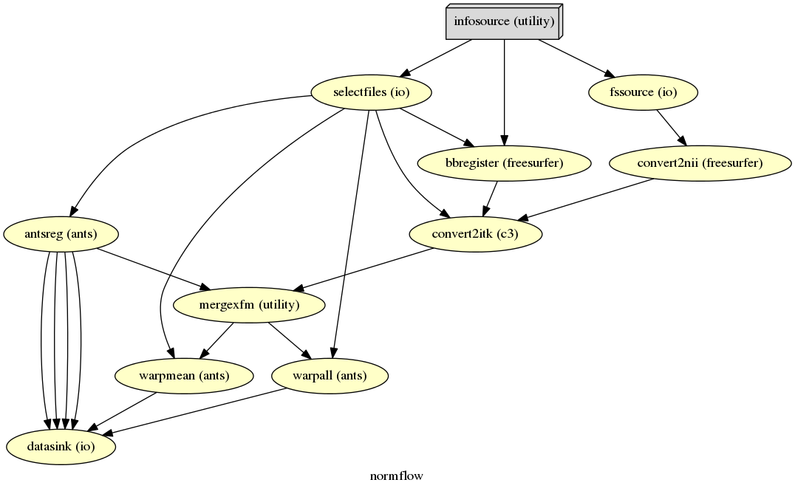

==========================
How To Normalize Your Data
==========================

Before you can start with a second level analysis you are facing the problem that all your output from the first level analysis are still in their subject specific subject-space. Because of the huge differences in brain size and cortical structure, it is very important to transform the data of each subject from its individual subject-space into a common standardized reference-space. This process of transformation is what we call normalization and it consists of a rigid body transformation (translations and rotations) as well as of a affine transformation (zooms and shears). The most common template that subject data is normalized to is the `MNI template <http://www.bic.mni.mcgill.ca/ServicesAtlases/HomePage>`_. 

There are many different approaches to when to normalize your data (e.g. before smoothing your data in preprocessing or after the estimation of your contrasts at the end of your first level analysis). I prefer to do the normalization after the first level model was estimated, as I don't want to introduce to many unnecessary transformations in the subject specific first level analysis.

There are also many different softwares that you could use to normalize your data and there is a lot of debate of which ones are better and which ones are worse. There is a very good paper by Klein et al. (2009), called `Evaluation of 14 nonlinear deformation algorithms applied to human brain MRI registration <http://www.sciencedirect.com/science/article/pii/S1053811908012974>`_, that summarizes and compares the main approaches. According to this paper and from my own personal experience, I highly recommend to use `ANTs <http://stnava.github.io/ANTs/>`_ to normalize your data. I also recommend to not use SPM8's normalization module (to see why check out `SPM12's release notes <http://www.fil.ion.ucl.ac.uk/spm/software/spm12/SPM12_Release_Notes.pdf#page=9>`_, page 9, section "8.5. Old Normalise"). In contrary to SPM8, SPM12's new normalization approach seems to do very good.

This section will show you how to use Nipype to do a normalization with ANTs (what I recommend) or with SPM12. I highly recommend the normalization with ANTs as it is much more accurate. But I also want to point out that the computation of ANTs normalization is much longer than the one with SPM12, which also does a good enough job.

Normalize Your Data with ANTs
==========================

Usually, we first normalize the subject specific anatomy to the template and than use the resulting transformation matrix to normalize the functional data (i.e. first level contrasts) to the template. But this also means that we assume that the functional and the anatomical data is laying on top of each other, or in other words, that they were coregistered to each other.

The coregistration of the functional data to the anatomical data means multiple interpolation of your data. That's why the coregistration and the normalization of your functional data should be done directly in one transformation. To account for both possible cases, the following script will show you both ways. The approach where both coregistration and normalization will be done in one step will be called **complete transformation**, and the approach where we only do a normalization will be called **partial transformation**. Partial does not mean that it doesn't lead to a complete normalization of the data, it just means that the coregistration of the functional and structural data was already done in an earlier step.

.. important::

   A big thanks to `Julia Huntenburg <https://github.com/juhuntenburg>`_! Without her help and knowledge about ANTs and Nipype this section wouldn't exist, as she provided me with the relevant code and structure of this pipeline.

Import modules and specify interface behaviors
**************************

But first, as always, we have to import necessary modules and tell the system where to find the FreeSurfer folder.

.. code-block:: py
   :linenos:

   # Import modules
   from os.path import join as opj
   from nipype.interfaces.ants import Registration, ApplyTransforms
   from nipype.interfaces.freesurfer import FSCommand, MRIConvert, BBRegister
   from nipype.interfaces.c3 import C3dAffineTool
   from nipype.interfaces.utility import IdentityInterface, Merge
   from nipype.interfaces.io import SelectFiles, DataSink, FreeSurferSource
   from nipype.pipeline.engine import Workflow, Node, MapNode
   from nipype.interfaces.fsl import Info
   
   # FreeSurfer - Specify the location of the freesurfer folder
   fs_dir = '~/nipype_tutorial/freesurfer'
   FSCommand.set_default_subjects_dir(fs_dir)

Define experiment specific parameters
**************************

Now we define the names of the folders used for this pipeline, we specify the list of subjects which should be normalized and specify which template the data should be normalized too. In this case it is the ``MNI152_T1_1mm_brain.nii.gz`` template.

.. code-block:: py
   :linenos:
   
   # Specify variables
   experiment_dir = '~/nipype_tutorial'          # location of experiment folder
   input_dir_1st = 'output_fMRI_example_1st'     # name of 1st-level output folder
   output_dir = 'output_fMRI_example_norm_ants'  # name of norm output folder
   working_dir = 'workingdir_fMRI_example_norm_ants'  # name of norm working directory
   subject_list = ['sub001', 'sub002', 'sub003',
                   'sub004', 'sub005', 'sub006',
                   'sub007', 'sub008', 'sub009',
                   'sub010']                     # list of subject identifiers
   
   # location of template file
   template = Info.standard_image('MNI152_T1_1mm_brain.nii.gz')

.. hint::

   For other templates check out the ones in FSL's ``standard`` folder, in my case this is under ``/usr/share/fsl/data/standard``. You can also see a list and access them much easier within Nipype with the following code:

   .. code-block:: py

      from nipype.interfaces.fsl import Info
      Info.standard_image()

Create nodes
**************************

In both cases, the **complete** as well as the **partial** transformation approach, we will use ANTs' ``Registration`` to compute the transformation matrix between the subject specific anatomy and the template:

.. code-block:: py
   :linenos:
  
   # Registration (good) - computes registration between subject's structural and MNI template.
   antsreg = Node(Registration(args='--float',
                               collapse_output_transforms=True,
                               fixed_image=template,
                               initial_moving_transform_com=True,
                               num_threads=1,
                               output_inverse_warped_image=True,
                               output_warped_image=True,
                               sigma_units=['vox']*3,
                               transforms=['Rigid', 'Affine', 'SyN'],
                               terminal_output='file',
                               winsorize_lower_quantile=0.005,
                               winsorize_upper_quantile=0.995,
                               convergence_threshold=[1e-06],
                               convergence_window_size=[10],
                               metric=['MI', 'MI', 'CC'],
                               metric_weight=[1.0]*3,
                               number_of_iterations=[[1000, 500, 250, 100],
                                                     [1000, 500, 250, 100],
                                                     [100, 70, 50, 20]],
                               radius_or_number_of_bins=[32, 32, 4],
                               sampling_percentage=[0.25, 0.25, 1],
                               sampling_strategy=['Regular',
                                                  'Regular',
                                                  'None'],
                               shrink_factors=[[8, 4, 2, 1]]*3,
                               smoothing_sigmas=[[3, 2, 1, 0]]*3,
                               transform_parameters=[(0.1,),
                                                     (0.1,),
                                                     (0.1, 3.0, 0.0)],
                               use_histogram_matching=True,
                               write_composite_transform=True),
                  name='antsreg')

This registration node ``antsreg`` might take a while, depending on the power of your system. One way to speed up this process is by using multiple cores/threads for the calculation. For example, use 4 cores for the calculation by setting the parameter ``num_threads`` to 4. But be aware, that if you run the normalization pipeline for 10 subjects in parallel, the code will try to launch 10 instances of ANTs registration with each asking for 4 cores.

Another approach to reduce the computation time of the registration is by reducing its accuracy by changing the parameters of ``Registration`` according to the following script: `https://github.com/stnava/ANTs/blob/master/Scripts/newAntsExample.sh <https://github.com/stnava/ANTs/blob/master/Scripts/newAntsExample.sh>`_ to the following:

.. code-block:: py
   :linenos:

   # Registration (fast) - computes registration between subject's structural and MNI template.
   antsregfast = Node(Registration(args='--float',
                                   collapse_output_transforms=True,
                                   fixed_image=template,
                                   initial_moving_transform_com=True,
                                   num_threads=1,
                                   output_inverse_warped_image=True,
                                   output_warped_image=True,
                                   sigma_units=['vox']*3,
                                   transforms=['Rigid', 'Affine', 'SyN'],
                                   terminal_output='file',
                                   winsorize_lower_quantile=0.005,
                                   winsorize_upper_quantile=0.995,
                                   convergence_threshold=[1e-08, 1e-08, -0.01],
                                   convergence_window_size=[20, 20, 5],
                                   metric=['Mattes', 'Mattes', ['Mattes', 'CC']],
                                   metric_weight=[1.0, 1.0, [0.5, 0.5]],
                                   number_of_iterations=[[10000, 11110, 11110],
                                                         [10000, 11110, 11110],
                                                         [100, 30, 20]],
                                   radius_or_number_of_bins=[32, 32, [32, 4]],
                                   sampling_percentage=[0.3, 0.3, [None, None]],
                                   sampling_strategy=['Regular',
                                                      'Regular',
                                                      [None, None]],
                                   shrink_factors=[[3, 2, 1],
                                                   [3, 2, 1],
                                                   [4, 2, 1]],
                                   smoothing_sigmas=[[4.0, 2.0, 1.0],
                                                     [4.0, 2.0, 1.0],
                                                     [1.0, 0.5, 0.0]],
                                   transform_parameters=[(0.1,),
                                                         (0.1,),
                                                         (0.2, 3.0, 0.0)],
                                   use_estimate_learning_rate_once=[True]*3,
                                   use_histogram_matching=[False, False, True],
                                   write_composite_transform=True),
                      name='antsregfast')

Now that we have the transformation matrix to normalize the functional data to the template, we  can use ANTs' ``ApplyTransforms`` to execute that. **Note**: Here you have again the option to specify the number of threads used in the interpolation of the data.

Partial Transformation
~~~~~~~~~~~~~~~~~~~~~~~~~~

In the partial transformation approach, we only need the following additional nodes. One to normalize the anatomical and one to normalize the functional data.

.. code-block:: py
   :linenos:
   
   # Apply Transformation - applies the normalization matrix to contrast images
   apply2con = MapNode(ApplyTransforms(args='--float',
                                       input_image_type=3,
                                       interpolation='Linear',
                                       invert_transform_flags=[False],
                                       num_threads=1,
                                       reference_image=template,
                                       terminal_output='file'),
                       name='apply2con', iterfield=['input_image'])
   
   # Apply Transformation - applies the normalization matrix to the mean image
   apply2mean = Node(ApplyTransforms(args='--float',
                                     input_image_type=3,
                                     interpolation='Linear',
                                     invert_transform_flags=[False],
                                     num_threads=1,
                                     reference_image=template,
                                     terminal_output='file'),
                     name='apply2mean')

Complete Transformation
~~~~~~~~~~~~~~~~~~~~~~~~~~

For the complete transformation, we also need to calculate the coregistration matrix (we will use FreeSurfer's `BBRegister` for that). But first, we need to use FreeSurfer's ``FreeSurferSource`` to grab the subject specific anatomy, convert it from MGZ to NII format with ``MRIConvert``. Than we need to transform the BBRegister transformation matrix to ITK format with ``C3dAffineTool`` and merge this transformation matrix with the transformation matrix from the normalization, i.e. ``antsreg``, by using a ``Merge`` node.

.. code-block:: py
   :linenos:

   # FreeSurferSource - Data grabber specific for FreeSurfer data
   fssource = Node(FreeSurferSource(subjects_dir=fs_dir),
                   run_without_submitting=True,
                   name='fssource')
   
   # Convert FreeSurfer's MGZ format into NIfTI format
   convert2nii = Node(MRIConvert(out_type='nii'), name='convert2nii')

   # Coregister the median to the surface
   bbregister = Node(BBRegister(init='fsl',
                                contrast_type='t2',
                                out_fsl_file=True),
                     name='bbregister')
   
   # Convert the BBRegister transformation to ANTS ITK format
   convert2itk = Node(C3dAffineTool(fsl2ras=True,
                                    itk_transform=True),
                      name='convert2itk')

   
   # Concatenate BBRegister's and ANTS' transforms into a list
   pickfirst = lambda x: x[0]
   merge = Node(Merge(2), iterfield=['in2'], name='mergexfm')

.. note::

   Before you can use the ``C3dAffineTool`` you have to make sure that you have the C3D routines on your system. Otherwise you get the following error: ``IOError: c3d_affine_tool could not be found on host``. To download the newest C3D version, go to `this homepage <http://sourceforge.net/projects/c3d/>`_. Afterwards, unpack and install the code on your system, this can be done with the following command: ``sudo tar xzvf ~/Downloads/c3d-nightly-Linux-x86_64.tar.gz -C /usr/local/.``. And finally, to make sure that your system finds the binaries of this software, add the following line to your ``.bashrc`` file: ``export PATH=/usr/local/c3d-1.0.0-Linux-x86_64/bin:$PATH``.

Now that we have the couplet transformation matrix, we can normalize the anatomical and functional data with the following two nodes:

.. code-block:: py
   :linenos:

   # Transform the contrast images. First to anatomical and then to the target
   warpall = MapNode(ApplyTransforms(args='--float',
                                     input_image_type=3,
                                     interpolation='Linear',
                                     invert_transform_flags=[False, False],
                                     num_threads=1,
                                     reference_image=template,
                                     terminal_output='file'),
                     name='warpall', iterfield=['input_image'])
   
   # Transform the mean image. First to anatomical and then to the target
   warpmean = Node(ApplyTransforms(args='--float',
                                   input_image_type=3,
                                   interpolation='Linear',
                                   invert_transform_flags=[False, False],
                                   num_threads=1,
                                   reference_image=template,
                                   terminal_output='file'),
                   name='warpmean')

.. note::

   A very important difference between the partial and the complete approach is that the parameter ``invert_transform_flags`` of the ``ApplyTransforms`` has two values in the case where we have two transformation matrices and only one value where we have only one transformation. If this is not accounted for than you get the following error: ``ERROR: The useInverse list must have the same number of entries as the transformsFileName list``.

Create the pipeline and connect nodes to it
**************************

.. code-block:: py
   :linenos:

   # Initiation of the ANTS normalization workflow
   normflow = Workflow(name='normflow')
   normflow.base_dir = opj(experiment_dir, working_dir)

For the **partial transformation** use the following code:

.. code-block:: py
   :linenos:

   # Connect up ANTS normalization components
   normflow.connect([(antsreg, apply2con, [('composite_transform', 'transforms')]),
                     (antsreg, apply2mean, [('composite_transform',
                                             'transforms')])
                     ])

For the **complete transformation** use the following code:

.. code-block:: py
   :linenos:
   
   # Connect up ANTS normalization components
   normflow.connect([(fssource, convert2nii, [('T1', 'in_file')]),
                     (convert2nii, convert2itk, [('out_file', 'reference_file')]),
                     (bbregister, convert2itk, [('out_fsl_file',
                                                 'transform_file')]),
                     (convert2itk, merge, [('itk_transform', 'in2')]),
                     (antsreg, merge, [(('composite_transform', pickfirst),
                                        'in1')]),
                     (merge, warpmean, [('out', 'transforms')]),
                     (merge, warpall, [('out', 'transforms')]),
                     ])

Establish Input & Output Stream
**************************

.. code-block:: py
   :linenos:
   
   # Infosource - a function free node to iterate over the list of subject names
   infosource = Node(IdentityInterface(fields=['subject_id']),
                     name="infosource")
   infosource.iterables = [('subject_id', subject_list)]
   
   # SelectFiles - to grab the data (alternativ to DataGrabber)
   anat_file = opj('freesurfer', '{subject_id}', 'mri/brain.mgz')
   func_file = opj(input_dir_1st, 'contrasts', '{subject_id}',
                   '_mriconvert*/*_out.nii.gz')
   func_orig_file = opj(input_dir_1st, 'contrasts', '{subject_id}', '[ce]*.nii')
   mean_file = opj(input_dir_1st, 'preprocout', '{subject_id}', 'mean*.nii')
   
   templates = {'anat': anat_file,
                'func': func_file,
                'func_orig': func_orig_file,
                'mean': mean_file,
                }
   
   selectfiles = Node(SelectFiles(templates,
                                  base_directory=experiment_dir),
                      name="selectfiles")
   
   # Datasink - creates output folder for important outputs
   datasink = Node(DataSink(base_directory=experiment_dir,
                            container=output_dir),
                   name="datasink")
   
   # Use the following DataSink output substitutions
   substitutions = [('_subject_id_', ''),
                    ('_apply2con', 'apply2con'),
                    ('_warpall', 'warpall')]
   datasink.inputs.substitutions = substitutions
   

For the **partial transformation** use the following code:

.. code-block:: py
   :linenos:

   # Connect SelectFiles and DataSink to the workflow
   normflow.connect([(infosource, selectfiles, [('subject_id', 'subject_id')]),
                     (selectfiles, apply2con, [('func', 'input_image')]),
                     (selectfiles, apply2mean, [('mean', 'input_image')]),
                     (selectfiles, antsreg, [('anat', 'moving_image')]),
                     (antsreg, datasink, [('warped_image',
                                           'antsreg.@warped_image'),
                                          ('inverse_warped_image',
                                           'antsreg.@inverse_warped_image'),
                                          ('composite_transform',
                                           'antsreg.@transform'),
                                          ('inverse_composite_transform',
                                           'antsreg.@inverse_transform')]),
                     (apply2con, datasink, [('output_image',
                                             'warp_partial.@con')]),
                     (apply2mean, datasink, [('output_image',
                                             'warp_partial.@mean')]),
                     ])

For the **complete transformation** use the following code:

.. code-block:: py
   :linenos:
   
   # Connect SelectFiles and DataSink to the workflow
   normflow.connect([(infosource, selectfiles, [('subject_id', 'subject_id')]),
                     (infosource, fssource, [('subject_id', 'subject_id')]),
                     (infosource, bbregister, [('subject_id', 'subject_id')]),
                     (selectfiles, bbregister, [('mean', 'source_file')]),
                     (selectfiles, antsreg, [('anat', 'moving_image')]),
                     (selectfiles, convert2itk, [('mean', 'source_file')]),
                     (selectfiles, warpall, [('func_orig', 'input_image')]),
                     (selectfiles, warpmean, [('mean', 'input_image')]),
                     (antsreg, datasink, [('warped_image',
                                           'antsreg.@warped_image'),
                                          ('inverse_warped_image',
                                           'antsreg.@inverse_warped_image'),
                                          ('composite_transform',
                                           'antsreg.@transform'),
                                          ('inverse_composite_transform',
                                           'antsreg.@inverse_transform')]),
                     (warpall, datasink, [('output_image', 'warp_complete.@warpall')]),
                     (warpmean, datasink, [('output_image', 'warp_complete.@warpmean')]),
                     ])

Run the pipeline and generate the graphs
**************************

Now, let's run the workflow with the following code:

.. code-block:: py
   :linenos:
   
   normflow.write_graph(graph2use='colored')
   normflow.run('MultiProc', plugin_args={'n_procs': 8})

.. hint::

   You can download the code for the partial and complete normalization with ANTS as a script here: `example_fMRI_2_normalize_ANTS_complete.py <http://github.com/miykael/nipype-beginner-s-guide/blob/master/scripts/example_fMRI_2_normalize_ANTS_complete.py>`_ or `example_fMRI_2_normalize_ANTS_partial.py <http://github.com/miykael/nipype-beginner-s-guide/blob/master/scripts/example_fMRI_2_normalize_ANTS_partial.py>`_

Visualize the workflow
***********************

The colored graph of the **partial**  normalization workflow looks as follows:

.. only:: html

    .. image:: images/norm_ants_colored_partial.png
       :width: 350pt
       :align: center

.. only:: latex

    .. image:: images/norm_ants_colored_partial.png
       :width: 250pt
       :align: center

The colored graph of the **complete**  normalization workflow looks as follows:

Resulting Folder Structure
***********************

The resulting folder structure looks for the **partial** and **complete** approach combined as follows:

.. code-block:: sh

    output_fMRI_example_norm_ants/
    ├── antsreg
    │   ├── sub001
    │   │   ├── transformComposite.h5
    │   │   ├── transformInverseComposite.h5
    │   │   ├── transform_InverseWarped.nii.gz
    │   │   └── transform_Warped.nii.gz
    │   ├── sub0..
    │   └── sub010
    ├── warp_partial
    │   ├── sub001
    │   │   ├── apply2con0
    │   │   │   └── con_0001_out_trans.nii.gz
    │   │   ├── apply2con1
    │   │   │   └── con_0002_out_trans.nii.gz
    │   │   ├── apply2con2
    │   │   │   └── con_0003_out_trans.nii.gz
    │   │   ├── apply2con3
    │   │   │   └── con_0004_out_trans.nii.gz
    │   │   ├── apply2con4
    │   │   │   └── ess_0005_out_trans.nii.gz
    │   │   ├── apply2con5
    │   │   │   └── ess_0006_out_trans.nii.gz
    │   │   └── meanarun001_trans.nii
    │   ├── sub0..
    │   └── sub010
    └── warp_complete
        ├── sub001
        │   ├── meanarun001_trans.nii
        │   ├── warpall0
        │   │   └── con_0001_trans.nii
        │   ├── warpall1
        │   │   └── con_0002_trans.nii
        │   ├── warpall2
        │   │   └── con_0003_trans.nii
        │   ├── warpall3
        │   │   └── con_0004_trans.nii
        │   ├── warpall4
        │   │   └── ess_0005_trans.nii
        │   └── warpall5
        │       └── ess_0006_trans.nii
        ├── sub0..
        └── sub010

Normalize Your Data with SPM12
==========================

The normalization of your data with SPM12 is much simpler than the one with ANTs. We only need to feed all the necessary inputs to a node called ``Normalize12``.

Import modules and specify interface behaviors
**************************

As always, let's import necessary modules and tell the system where to find MATLAB.

.. code-block:: py
   :linenos:

   # Import modules
   from os.path import join as opj
   from nipype.interfaces.spm import Normalize12
   from nipype.interfaces.utility import IdentityInterface
   from nipype.interfaces.io import SelectFiles, DataSink
   from nipype.algorithms.misc import Gunzip
   from nipype.pipeline.engine import Workflow, Node, MapNode
   
   # Specification to MATLAB
   from nipype.interfaces.matlab import MatlabCommand
   MatlabCommand.set_default_paths('/usr/local/MATLAB/R2014a/toolbox/spm12')
   MatlabCommand.set_default_matlab_cmd("matlab -nodesktop -nosplash")
   

Define experiment specific parameters
**************************

.. code-block:: py
   :linenos:
   
   # Specify variables
   experiment_dir = '~/nipype_tutorial'         # location of experiment folder
   input_dir_1st = 'output_fMRI_example_1st'    # name of 1st-level output folder
   output_dir = 'output_fMRI_example_norm_spm'  # name of norm output folder
   working_dir = 'workingdir_fMRI_example_norm_spm'  # name of working directory
   subject_list = ['sub001', 'sub002', 'sub003',
                   'sub004', 'sub005', 'sub006',
                   'sub007', 'sub008', 'sub009',
                   'sub010']                    # list of subject identifiers
   
   # location of template in form of a tissue probability map to normalize to
   template = '/usr/local/MATLAB/R2014a/toolbox/spm12/tpm/TPM.nii'

It's important to note that SPM12 provides its own template ``TMP.nii`` to which the data will be normalized to.

Create nodes
**************************

The functional and anatomical data that we want to normalize is in compressed ZIP format, which SPM12 can't handle. Therefore we first have to unzip those files with ``Gunzip``, before we can feed those files to SPM's ``Normalize12`` node.

.. code-block:: py
   :linenos:

   # Gunzip - unzip the structural image
   gunzip_struct = Node(Gunzip(), name="gunzip_struct")
   
   # Gunzip - unzip the contrast image
   gunzip_con = MapNode(Gunzip(), name="gunzip_con",
                        iterfield=['in_file'])
   
   # Normalize - normalizes functional and structural images to the MNI template
   normalize = Node(Normalize12(jobtype='estwrite',
                                tpm=template,
                                write_voxel_sizes=[1, 1, 1]),
                    name="normalize")

Create the pipeline and connect nodes to it
**************************

.. code-block:: py
   :linenos:

   # Specify Normalization-Workflow & Connect Nodes
   normflow = Workflow(name='normflow')
   normflow.base_dir = opj(experiment_dir, working_dir)
   
   # Connect up ANTS normalization components
   normflow.connect([(gunzip_struct, normalize, [('out_file', 'image_to_align')]),
                     (gunzip_con, normalize, [('out_file', 'apply_to_files')]),
                     ])

Establish Input & Output Stream
**************************

.. code-block:: py
   :linenos:
   
   # Infosource - a function free node to iterate over the list of subject names
   infosource = Node(IdentityInterface(fields=['subject_id']),
                     name="infosource")
   infosource.iterables = [('subject_id', subject_list)]
   
   # SelectFiles - to grab the data (alternativ to DataGrabber)
   anat_file = opj('data', '{subject_id}', 'struct.nii.gz')
   con_file = opj(input_dir_1st, 'contrasts', '{subject_id}',
                           '_mriconvert*/*_out.nii.gz')
   templates = {'anat': anat_file,
                'con': con_file,
                }
   selectfiles = Node(SelectFiles(templates,
                                  base_directory=experiment_dir),
                      name="selectfiles")
   
   # Datasink - creates output folder for important outputs
   datasink = Node(DataSink(base_directory=experiment_dir,
                            container=output_dir),
                   name="datasink")
   
   # Use the following DataSink output substitutions
   substitutions = [('_subject_id_', '')]
   datasink.inputs.substitutions = substitutions
   
   # Connect SelectFiles and DataSink to the workflow
   normflow.connect([(infosource, selectfiles, [('subject_id', 'subject_id')]),
                     (selectfiles, gunzip_struct, [('anat', 'in_file')]),
                     (selectfiles, gunzip_con, [('con', 'in_file')]),
                     (normalize, datasink, [('normalized_files',
                                             'normalized.@files'),
                                            ('normalized_image',
                                             'normalized.@image'),
                                            ('deformation_field',
                                             'normalized.@field'),
                                            ]),
                     ])

Run the pipeline and generate the graphs
**************************

Now, let's run the workflow with the following code:

.. code-block:: py
   :linenos:
   
   normflow.write_graph(graph2use='colored')
   normflow.run('MultiProc', plugin_args={'n_procs': 8})

.. hint::

   You can download the code for the normalization with SPM12 as a script here: `example_fMRI_2_normalize_SPM.py <http://github.com/miykael/nipype-beginner-s-guide/blob/master/scripts/example_fMRI_2_normalize_SPM.py>`_

Visualize the workflow
***********************

The colored graph of this normalization workflow looks as follows:

.. only:: html

    .. image:: images/norm_spm_colored.png
       :width: 325pt
       :align: center

.. only:: latex

    .. image:: images/norm_spm_colored.png
       :width: 225pt
       :align: center

Resulting Folder Structure
***********************

The resulting folder structure looks as follows:

.. code-block:: sh

    output_fMRI_example_norm_spm/
    └── normalized
        ├── sub001
        │   ├── wcon_0001_out.nii
        │   ├── wcon_0002_out.nii
        │   ├── wcon_0003_out.nii
        │   ├── wcon_0004_out.nii
        │   ├── wess_0005_out.nii
        │   ├── wess_0006_out.nii
        │   ├── wstruct.nii
        │   └── y_struct.nii
        ├── sub0..
        └── sub010
